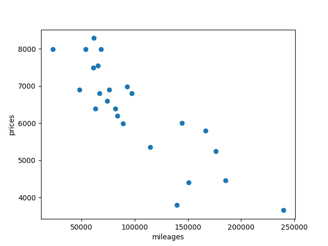
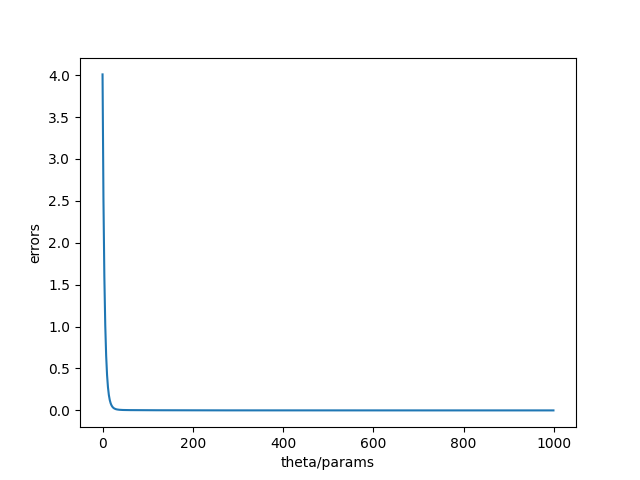
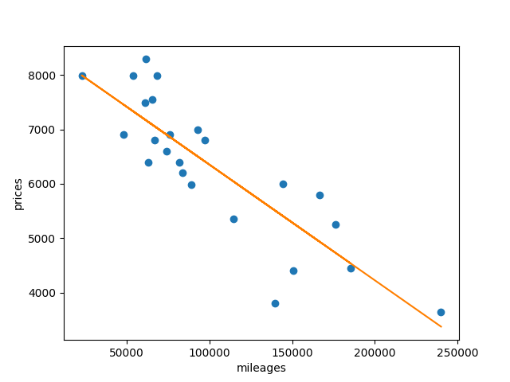

### Objectives

The aim of this project is to introduce you to the basic concept behind machine learning.
For this project, you will have to create a program that predicts the price of a car by
using a linear function train with a gradient descent algorithm.


### Documentation

#### Linear regression and Gradient descent
- Introduction à la régression linéaire (moindres carres + coefficient de correlation) -
https://www.youtube.com/watch?v=_b_50uILuok&t=493s
- Linear Regression Gradient Descent | Machine Learning | Explained Simply - https://www.youtube.com/watch?v=EfsjEOb596Q&t=137s
- DESCENTE DE GRADIENT (GRADIENT DESCENT) - ML#4 - https://www.youtube.com/watch?v=rcl_YRyoLIY
- La descente de gradient (stochastique) | Intelligence artificielle 42 - https://www.youtube.com/watch?v=Q9-vDFvDdfg
- Gradient Descent in Linear Regression - https://www.geeksforgeeks.org/gradient-descent-in-linear-regression/

#### Machine learning
- machine learning playlist - https://www.youtube.com/watch?v=QqE5uYlGRcI&list=PLOZzVgsgePPgNl-ZRpavBpreo54vXIUTz&index=2

#### Precision (R2)
- Coefficient de détermination - https://www.youtube.com/watch?v=bWXTm-q37Sg


### Commands
```
Commands:
- "train": train the model
- "estimate": estimate a price from a mileage
- "show raw": show raw datas
- "show costs": show costs plot
- "show final": show final graphs
```
### Graphs
#### Raw 
</img>
#### Costs errors
</img>
#### After training (prediction)
</img>
